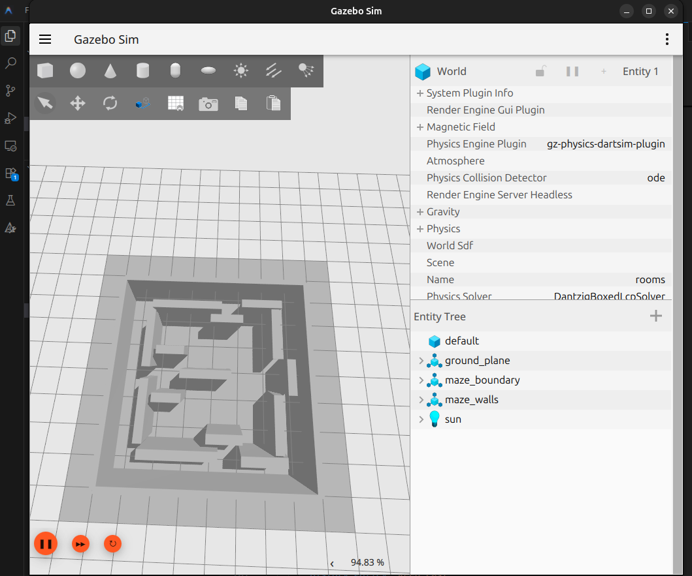
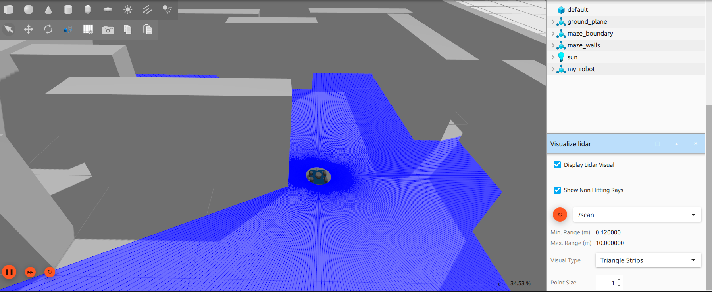
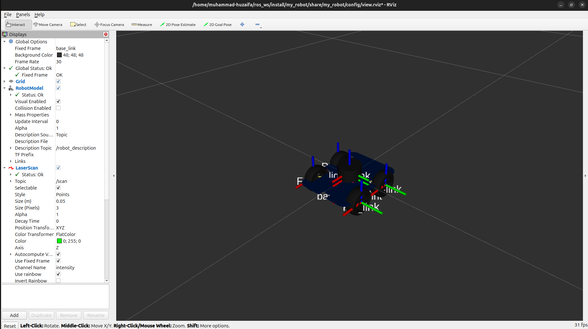
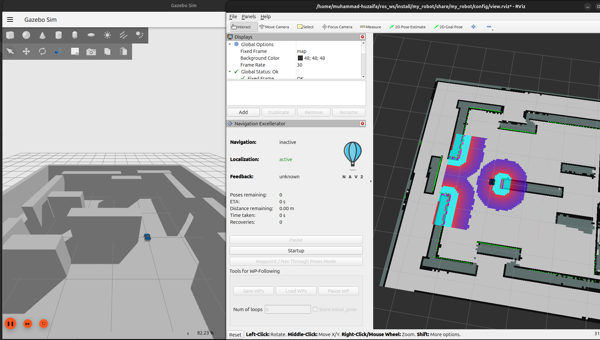
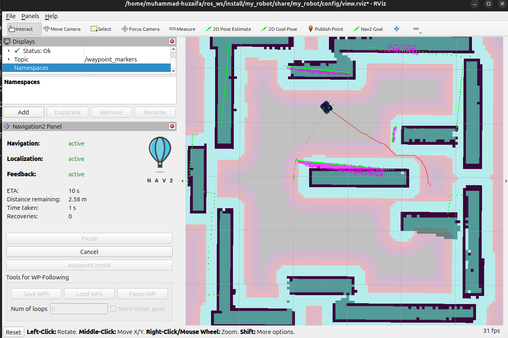
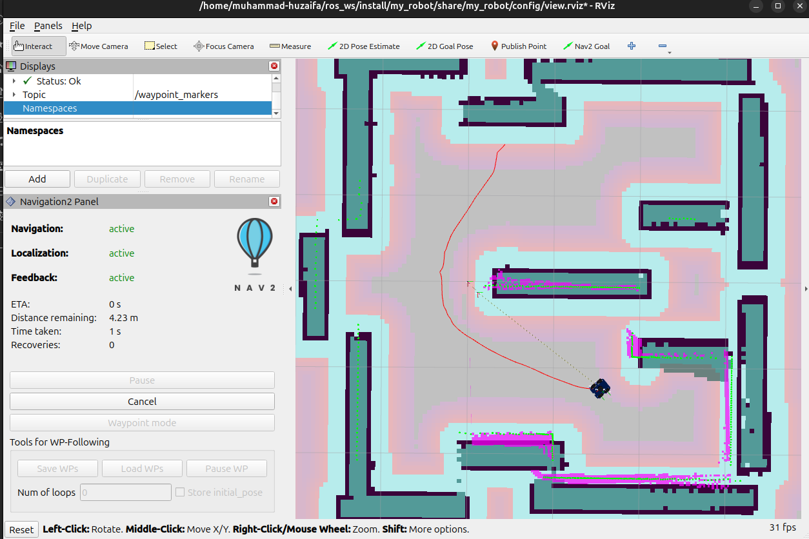

# 🤖 ROS 2 Jazzy | Mapping & Autonomous Navigation in Simulation

A simulation-based autonomous mobile robot project built with ROS 2 Jazzy —
covering the complete pipeline from 3D mechanical design to real-time mapping
and autonomous navigation, entirely in simulation.

---

## 📸 Demo

### Custom Gazebo Environment

> Custom maze-style environment built in Gazebo for mapping and navigation testing.

### LiDAR Sensor Visualization

> Robot's LiDAR sensor scanning the environment in real time inside Gazebo.

### Robot Model in RViz2

> URDF robot model loaded in RViz2 with laser scan data displayed.

### Nav2 Localization & Costmap

> Nav2 stack active with costmaps rendered in RViz2 alongside Gazebo simulation.

### Autonomous Navigation — Path Planning

> Robot actively navigating through the saved map with planned path visible in RViz2.

### Autonomous Navigation — Full Traversal

> Robot completing navigation through the environment with Nav2 feedback active.

---

## 📌 Overview

This project demonstrates a full autonomous navigation pipeline using ROS 2 Jazzy.
The robot was designed in SolidWorks and exported as a URDF model, simulated in
Gazebo inside a custom-built maze environment, mapped in real time using SLAM Toolbox,
and navigated autonomously using the Nav2 stack — with everything visualized in RViz2.

---

## ✨ Features

- 🔩 Robot designed in SolidWorks and exported as URDF/Xacro
- 🌍 Custom maze environment built from scratch in Gazebo
- 📡 LiDAR sensor integrated and visualized in Gazebo and RViz2
- 🗺️ Real-time mapping using ROS 2 SLAM Toolbox
- 💾 Map saved and reloaded for autonomous navigation
- 🧭 Autonomous point-to-point navigation using ROS 2 Nav2
- 👁️ Full visualization and monitoring in RViz2
- 🔁 Complete sim pipeline: design → simulate → map → navigate

---

## 🛠️ Tech Stack

| Tool            | Purpose                          |
|-----------------|----------------------------------|
| ROS 2 Jazzy     | Core robotics framework          |
| SolidWorks      | Robot 3D design & URDF export    |
| Gazebo          | Physics simulation & environment |
| SLAM Toolbox    | Real-time environment mapping    |
| Nav2            | Autonomous navigation stack      |
| RViz2           | Visualization & monitoring       |
| Python / C++    | Node development                 |
| URDF / Xacro    | Robot description format         |

---

## 📁 Repository Structure

```
ros2_jazzy_mapping_navigation_slam_nav2/
├── urdf/                  # Robot URDF/Xacro files from SolidWorks
├── launch/                # Launch files for Gazebo, SLAM, and Nav2
├── maps/                  # Saved maps generated by SLAM Toolbox
├── worlds/                # Custom Gazebo maze environment
├── config/                # Nav2 and SLAM Toolbox parameter files
├── rviz/                  # RViz2 configuration files
├── images/                # README screenshots
└── README.md
```

---

## ⚙️ Dependencies

ROS 2 Jazzy and the following packages:

```bash
sudo apt install \
  ros-jazzy-slam-toolbox \
  ros-jazzy-nav2-bringup \
  ros-jazzy-gazebo-ros-pkgs \
  ros-jazzy-robot-state-publisher \
  ros-jazzy-joint-state-publisher-gui \
  ros-jazzy-xacro
```

---

## 🚀 How to Run

### 1. Clone the repository

```bash
git clone https://github.com/Gryphinxhuzaifa/ros2_jazzy_mapping_navigation_slam_nav2.git
cd ros2_jazzy_mapping_navigation_slam_nav2
```

### 2. Build the workspace

```bash
colcon build
source install/setup.bash
```

### 3. Launch the robot in Gazebo

```bash
ros2 launch launch/gazebo.launch.py
```

### 4. Run SLAM Toolbox — start mapping

```bash
ros2 launch launch/slam.launch.py
```

> Drive the robot around the maze in Gazebo to build the map. Monitor progress live in RViz2.

### 5. Save the map

```bash
ros2 run nav2_map_server map_saver_cli -f maps/my_map
```

### 6. Launch Nav2 — autonomous navigation

```bash
ros2 launch launch/navigation.launch.py map:=maps/my_map.yaml
```

> Set a goal pose in RViz2 and the robot will autonomously navigate to it.

---

## 🗺️ Pipeline

```
SolidWorks Design
      ↓
URDF Export
      ↓
Gazebo Simulation (custom maze environment)
      ↓
SLAM Toolbox → Real-time mapping → Map saved
      ↓
Nav2 → Autonomous navigation through saved map
      ↓
RViz2 Visualization
```

---

## 📊 Results

- ✅ Successfully designed and simulated a custom robot in Gazebo
- ✅ LiDAR sensor fully integrated and visualized in real time
- ✅ Mapped a custom maze environment in real time using SLAM Toolbox
- ✅ Saved and reloaded the generated map for navigation
- ✅ Robot autonomously navigated through the environment using Nav2
- ✅ Full pipeline visualized and monitored in RViz2

---

## 📋 Requirements

- Ubuntu 24.04
- ROS 2 Jazzy
- Gazebo (compatible with ROS 2 Jazzy)
- SolidWorks (for URDF export only — not required to run)

---

## 👤 Author

**Muhammad Huzaifa**
Robotics Engineer | ROS 2 · C++ · Python · Arduino · MATLAB/Simulink
Embedded systems, control, and autonomous robot development

🌐 GitHub: [@Gryphinxhuzaifa](https://github.com/Gryphinxhuzaifa)
📧 gamernornor7@gmail.com
📍 Islamabad, Pakistan

---

## 📄 License

This project is licensed under the MIT License.

---

> ⭐ If you found this project useful, consider giving it a star!
